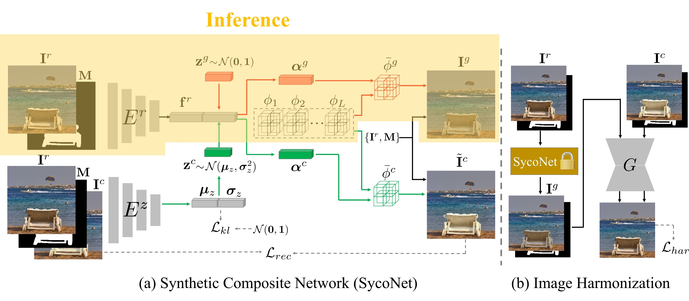

# SycoNet: Domain Adaptive Image Harmonization

This is the official repository for the following paper:

> **Deep Image Harmonization with Learnable Augmentation**  [[arXiv]](https://arxiv.org/pdf/2308.00376.pdf)<br>
>
> Li Niu, Junyan Cao, Wenyan Cong, Liqing Zhang<br>
> Accepted by **ICCV 2023**.
> 
SycoNet can generate multiple plausible synthetic composite images based on a real image and a foreground mask, which is useful to construct pairs of synthetic composite images and real images for harmonization. We release the SycoNet inference code and model. **The released model is first trained on [iHarmony4](https://github.com/bcmi/Image-Harmonization-Dataset-iHarmony4) and then finetuned on [ccHarmony](https://github.com/bcmi/Image-Harmonization-Dataset-ccHarmony), because ccHarmony can reflect the illumination variation more faithfully.** 

**The released model could be used to generate high-quality synthetic composite images for real images to augment the small-scale training set.**

<div align="center">
	
</div>

# Setup

Clone the repository:
```
git clone git@github.com:bcmi/SycoNet-Adaptive-Image-Harmonization.git
```
Install Anaconda and create a virtual environment:
```
conda create -n syconet python=3.6
conda activate syconet
```
Install PyTorch:
```
conda install pytorch==1.10.1 torchvision==0.11.2 torchaudio==0.10.1 cudatoolkit=11.3 -c pytorch -c conda-forge
```
Install necessary packages:
```
pip install -r requirements.txt
```
Build Trilinear:
```
cd trilinear_cpp
sh setup.sh
```
Modify `CUDA_HOME` as your own path in `setup.sh`. You can refer to [this repository](https://github.com/HuiZeng/Image-Adaptive-3DLUT) for more solutions.

# Inference

Download SycoNet model `pretrained_net_Er.pth` and 3D LUTs `pretrained_net_LUTs.pth` from [Baidu Cloud](https://pan.baidu.com/s/1wIWxb37yIVccxB0kM-FnnQ) (access code:o4rt) or [GoogleDrive](https://drive.google.com/drive/folders/12vtiUhrM_EKtVh1c2k-Tu5-MZg4AGqBZ?usp=sharing). Put them in the folder `checkpoints\syco`. 

## Test on a single image
Modify `real` and `mask` in `demo_test.sh` as your own real image path and foreground mask path respectively. Modify  `augment_num` as your expected number of generated composite images per pair of real image and foreground mask. Then, run the following command:
```
sh demo_test_single.sh
```
Our SycoNet could generate composite images for the input real image and foreground mask in the folder `results\syco\test_pretrained`.

## Test on iHarmony4 dataset


Download [iHarmony4](https://github.com/bcmi/Image-Harmonization-Dataset-iHarmony4) and modify `dataset_root`, `dataset_name` in `demo_test_iHarmony4.sh` as your own dataset path. Then, run the following command:

```
sh demo_test_iHarmony4.sh
```

Our SycoNet could generate composite images for the input real images and foreground masks in the specified dataset in the folder `results\syco\test_pretrained`.


# Other Resources

+ [Image-Harmonization-Dataset-iHarmony4](https://github.com/bcmi/Image-Harmonization-Dataset-iHarmony4)
+ [Awesome-Image-Harmonization](https://github.com/bcmi/Awesome-Image-Harmonization)
+ [Awesome-Image-Composition](https://github.com/bcmi/Awesome-Image-Composition)


